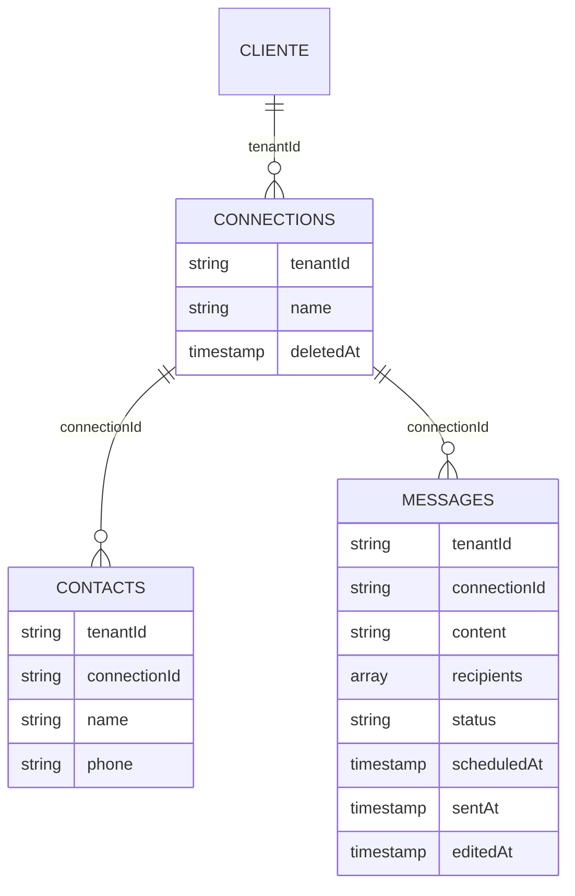
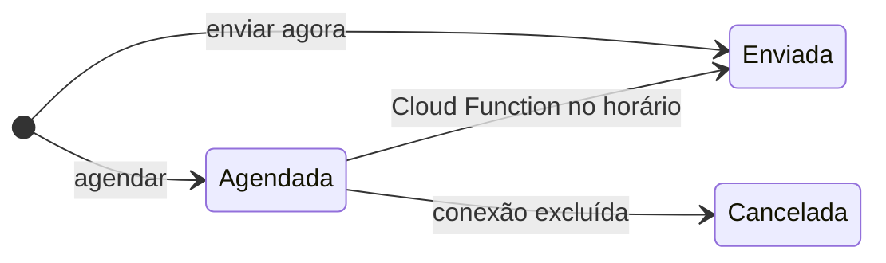
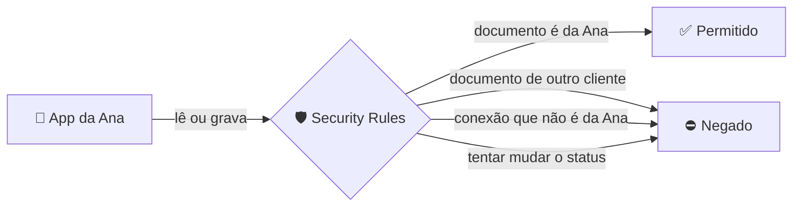
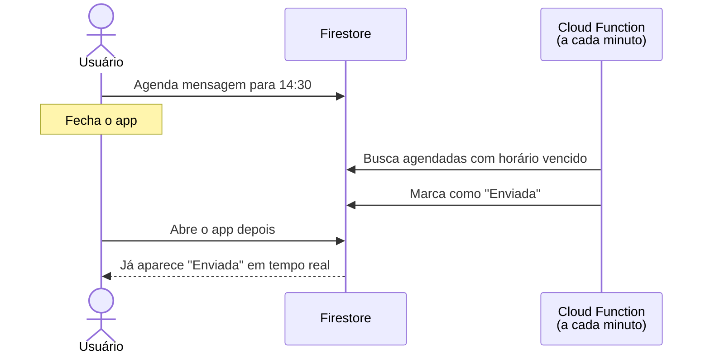

<div align="center">

# Broadcast de mensagens
### Teste prático

**Envio e agendamento de mensagens para contatos, com isolamento total entre clientes.**

[](https://testepratico-broadcast.web.app)


</div>

---

## 🧭 Sumário

- [Como testar em 3 minutos](#-como-testar-em-3-minutos)
- [Requisitos atendidos](#-requisitos-atendidos)
- [Além do pedido](#-além-do-pedido)
- [Modelagem de dados](#-modelagem-de-dados)
- [Isolamento entre clientes](#-isolamento-entre-clientes)
- [Como funciona o agendamento](#-como-funciona-o-agendamento)
- [Decisões técnicas](#-decisões-técnicas)
- [Limitações conhecidas](#-limitações-conhecidas)
- [Estrutura do projeto](#-estrutura-do-projeto)
- [Rodando localmente](#-rodando-localmente)

---

## ⚡ Como testar em 3 minutos

| # | Faça | Observe |
|:-:|---|---|
| 1 | Crie uma conta em [testepratico-broadcast.web.app](https://testepratico-broadcast.web.app) | Você entra direto na lista de conexões |
| 2 | Crie uma **conexão** e adicione alguns **contatos** | Telefone aceito em qualquer formato, como `(11) 99999-8888` |
| 3 | Na aba **Mensagens**, agende uma mensagem para **daqui a 2 minutos** | Ela aparece como **Agendada** |
| 4 | **Feche a aba** do navegador e volte depois de uns 3 minutos | A mensagem está como **Enviada**, mudada pelo servidor |
| 5 | Agende outra e **deixe a aba aberta** | O status muda sozinho na tela, sem recarregar |
| 6 | Copie o link da conexão, saia e **crie uma segunda conta** | Ao abrir o link, aparece **"Conexão não encontrada"** |

---

## ✅ Requisitos atendidos

| Requisito | Como foi atendido |
|---|---|
| 🔐 Login e cadastro | Firebase Authentication com e-mail e senha, validação de formulário e mensagens de erro em português |
| 👤 Cada usuário é um cliente | O `uid` do usuário é o `tenantId` de todos os dados dele |
| 🔌 CRUD de conexões | Criar, listar, renomear e excluir |
| 📇 CRUD de contatos por conexão | Criar, listar, editar e excluir, cada conexão com a sua lista |
| ☑️ Selecionar um ou mais contatos | Seletor com busca por nome ou telefone e botão "Selecionar todos" |
| ✍️ Escrever e enviar na hora | Modal de composição com a opção **Enviar agora** |
| ⏰ Agendar para data e hora futuras | Opção **Agendar**, com a data validada no formulário e no servidor |
| 👀 Visualizar e filtrar | Lista com filtro **Todas / Agendadas / Enviadas** e contadores |
| 🤖 Envio agendado | Cloud Function que roda a cada minuto, independente de o app estar aberto |
| 🏢 Multi-tenant e isolamento | Security Rules do Firestore, cobertas por **~67 testes automatizados** |
| 🎨 Material UI + Tailwind | MUI para componentes, Tailwind para layout, convivendo sem conflito de estilos |
| ⚙️ Sem classes | Nenhuma classe no projeto. Funções puras, hooks e dados imutáveis |
| 🔄 Tempo real | Todas as listas atualizam sozinhas, inclusive o status das mensagens |
| ⚡ Vite | Frontend inteiro em Vite |
| 🗂️ Sem subcoleções | Três coleções na raiz, ligadas por campos |
| 📁 `/functions` e `/web` | Backend e frontend separados, cada um com seu próprio pacote |

---

## ✨ Além do pedido

- 🔎 **Busca e ordenação de contatos**
- ❌ **Cancelamento automático**: Excluir uma conexão cancela as mensagens agendadas dela
- 🔗 **Estado na URL**: aba, busca, ordenação e filtro sobrevivem ao F5 e podem ser compartilhados
- 📱 **100% Responsivo**
- 🧪 **Testes automatizados** das regras de segurança, das Cloud Functions e das regras de negócio do frontend

---

## 🗃️ Modelagem de dados

Três coleções na raiz do Firestore, **sem subcoleções**. As relações são feitas por campos: todo documento carrega o `tenantId` do cliente dono, e contatos e mensagens carregam também o `connectionId`.



| Coleção | Guarda | Destaques |
|---|---|---|
| `connections` | As conexões de cada cliente | Exclusão lógica pelo `deletedAt`, o histórico nunca se perde |
| `contacts` | Os contatos de cada conexão | Telefone sempre no padrão internacional (`+5511999998888`) |
| `messages` | As mensagens de cada conexão | `recipients` guarda uma **cópia** de nome e telefone no momento do envio |

### Ciclo de vida da mensagem



> 🔒 **Só o servidor muda o status.** O app cria e edita mensagens, mas as regras de segurança impedem qualquer cliente de marcar uma mensagem como enviada ou cancelada.

---

## 🛡️ Isolamento entre clientes

A garantia de isolamento está **no banco de dados**, não na tela. Mesmo que alguém altere o app ou chame o Firestore direto, as **Security Rules** recusam qualquer operação fora do próprio tenant.



| Camada | O que garante |
|---|---|
| **Leitura** | Só lê documentos com o próprio `tenantId`. Uma consulta que poderia trazer dados de outro cliente é recusada inteira |
| **Criação** | O `tenantId` precisa ser o do usuário logado, e a regra **confere no banco** que a conexão informada é dele e está ativa |
| **Edição** | `tenantId` e `connectionId` nunca mudam, então nada é movido para outro cliente. Cada coleção aceita só os campos editáveis dela |
| **Campos e datas** | Lista fechada de campos, limites de tamanho e datas sempre definidas pelo servidor |
| **Status** | Só as Cloud Functions mudam o status de uma mensagem |

### 🧪 Provado com testes

As regras são cobertas por **67 testes automatizados**, que rodam contra o emulador do Firestore simulando dois clientes e um visitante sem login.

| Coleção | Testes | Exemplos do que é verificado |
|---|:-:|---|
| Conexões | 21 | Outro cliente não lê, não edita e não transfere uma conexão |
| Contatos | 20 | Não cria contato na conexão de outro cliente, mesmo usando o próprio `tenantId` |
| Mensagens | 26 | O cliente não consegue marcar uma agendada como enviada |

Cada coleção tem testes do que **deve** ser permitido e do que **deve** ser negado. Só com testes de bloqueio, uma regra que negasse tudo passaria.

---

## ⏰ Como funciona o agendamento



| Function | Quando roda | O que faz |
|---|---|---|
| `processScheduledMessages` | A cada 1 minuto | Envia as agendadas cujo horário já passou, em lotes |
| `onConnectionDeleted` | Quando uma conexão é excluída | Cancela as agendadas daquela conexão. As já enviadas ficam no histórico |

- 🔁 **Seguro contra edição simultânea.** Se o usuário edita uma mensagem no exato momento em que a function vai enviá-la, a function não sobrescreve a edição e tenta de novo na rodada seguinte.
- ♻️ **Idempotente.** Rodar a mesma function duas vezes dá o mesmo resultado, o que torna seguras as reexecuções automáticas do Firebase.


---

## 🧠 Decisões técnicas

| Decisão | Por quê |
|---|---|
| **Exclusão lógica de conexões** | Preserva o histórico de mensagens. A conexão some da tela, mas os dados continuam guardados |
| **Cópia dos destinatários na mensagem** | Excluir ou editar um contato não altera o histórico do que já foi enviado |
| **Telefone no padrão internacional** | Um formato só no banco evita duplicados disfarçados, como `(11) 9999...` e `11 9999...` |
| **Validação de tudo que vem de fora** | Formulários, documentos do banco e variáveis de ambiente passam por zod, e os tipos do TypeScript saem dessas validações |
| **Paradigma funcional** | Nenhuma classe. Funções puras para regras de negócio, hooks para estado e recursão no lugar de laços nas functions |
| **Tempo real em todas as listas** | Conexões, contatos e mensagens usam os listeners do Firestore. O status "Enviada" aparece sem recarregar |
| **Filtro e ordenação na tela** | As listas são de uma conexão só e já estão carregadas em tempo real. Isso dispensa índices extras no banco |
| **Poucas dependências** | Além do obrigatório, só React Router (rotas) e zod (validação). Seletor de data, formulários e estado global foram resolvidos sem bibliotecas |
| **Mensagens de erro em português** | Erros técnicos do Firebase viram mensagens claras para o usuário, e o detalhe vai para o console |

---

## 📁 Estrutura do projeto

```
.
├── firestore.rules            # 🛡️ regras de segurança (isolamento)
├── firestore.indexes.json     # índices do Firestore
├── firebase.json
│
├── functions/                 # ☁️ Cloud Functions
│   ├── src/
│   │   ├── scheduled/         # function agendada (a cada minuto)
│   │   ├── triggers/          # function disparada por alteração no banco
│   │   └── messages/          # regras de envio e cancelamento
│   └── tests/                 # testes contra o emulador
│
└── web/                       # 🖥️ Frontend (Vite + React)
    ├── src/
    │   ├── app/               # rotas, layouts e tema
    │   ├── features/          # uma pasta por funcionalidade
    │   │   ├── auth/
    │   │   ├── connections/
    │   │   ├── contacts/
    │   │   └── messages/
    │   └── shared/            # componentes e utilitários comuns
    └── tests/rules/           # testes das regras de segurança
```

Cada pasta em `features/` concentra tudo de uma funcionalidade: telas, componentes, acesso aos dados e validações.

---

## 💻 Rodando localmente

### Requisitos

- **Node.js 22+**
- **Java 21**, usado pelos emuladores do Firebase
- **Firebase CLI**: `npm install -g firebase-tools`

### Instalação

```bash
cd web && npm install
cd ../functions && npm install
```

Crie o arquivo `web/.env` a partir do `web/.env.example`, com a configuração de um app web do Firebase (em *Configurações do projeto → Seus apps*).

### Subindo o ambiente

Em desenvolvimento, o app usa os **emuladores** do Firebase: nada toca o banco real.

| Jeito | Como |
|---|---|
| ⌨️ Atalho do VS Code | **Ctrl+Shift+B** sobe os emuladores e o app lado a lado |
| 🖐️ Manual | `firebase emulators:start` na raiz e `npm run dev` dentro de `web` |

O app abre em `http://localhost:5173` e o painel dos emuladores em `http://127.0.0.1:4000`.

---

<div align="center">

Feito por **[Igor Colombini](https://github.com/igorcol)**

</div>